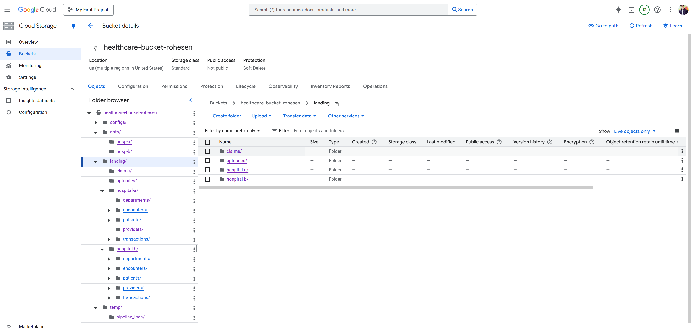
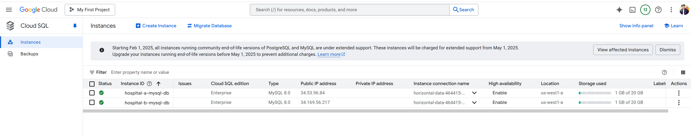
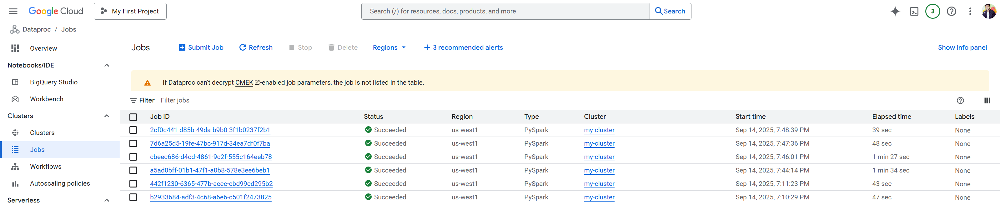
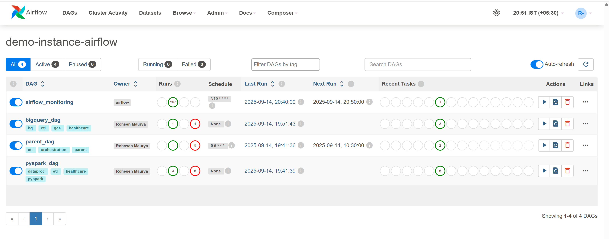
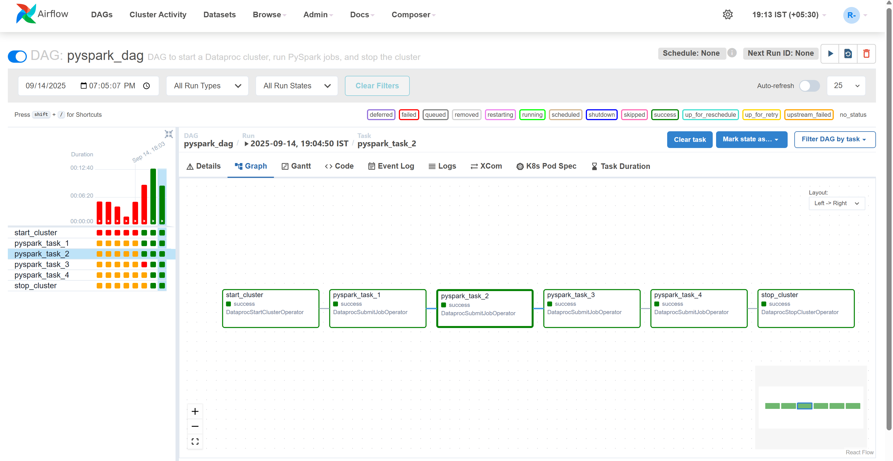
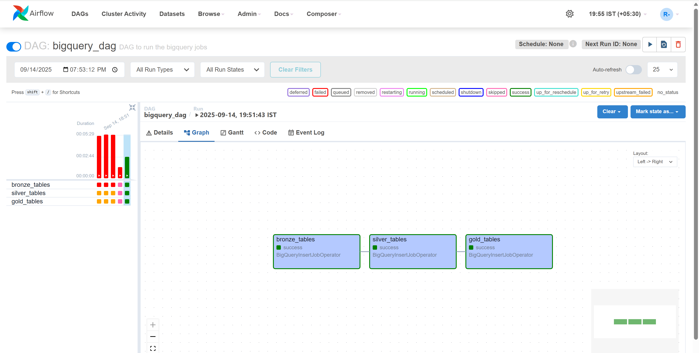
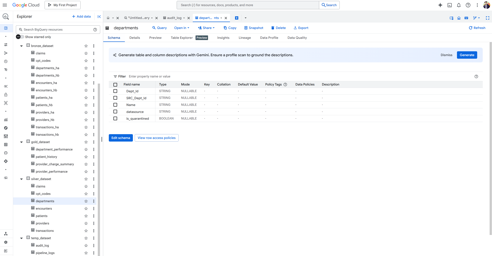
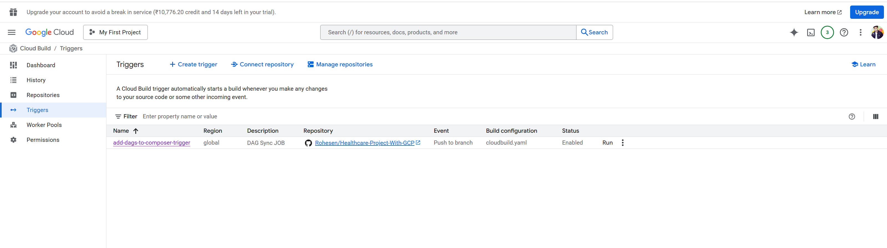
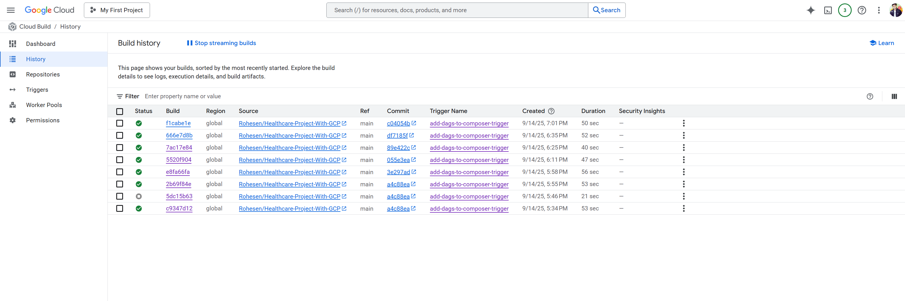
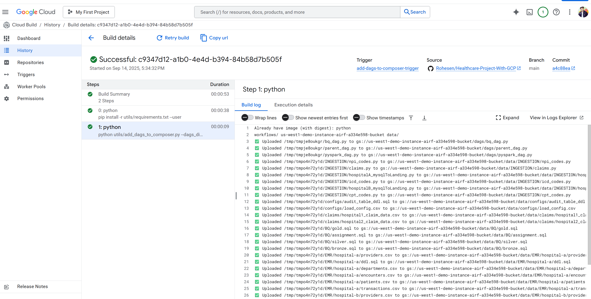

# 🏥 Healthcare Project With GCP  

End-to-end **Healthcare Revenue Cycle Management (RCM)** Data Lake & Analytics on **Google Cloud Platform (GCP)**  

✅ Centralizes healthcare data from **EMRs, claims, CPT & NPI codes** into a unified data lake  
✅ Stores raw & processed data in **Google Cloud Storage (GCS) 📦**  
✅ Automates **ETL pipelines** with **Cloud Composer ⏱️** & **Dataproc (Apache Spark) 🔥**  
✅ Implements **Medallion Architecture (Bronze → Silver → Gold) 🪞** for structured, reliable data  
✅ Uses **SCD Type 2 🕒** + **CDM (Common Data Model) 📊** for historical tracking & standardization  
✅ Powers **BigQuery 🗃️** for advanced analytics & KPI dashboards on revenue and claims  
✅ Leverages **Cloud SQL (MySQL) 🗄️** for EMR transactional data  
✅ Ensures **CI/CD ⚡** with **GitHub 🐙** & **Cloud Build 🔨** for seamless deployments  
✅ Provides **logging, monitoring & error handling 📋** across all pipelines  
✅ Helps healthcare providers & insurers **reduce claim denials, improve revenue tracking, and streamline billing 💰**  

---
## 📑 Table of Contents  

1. [🌟 Overview](#-overview)  
2. [🎯 Motivation](#-motivation)  
3. [🏗️ Architecture](#️-architecture)  
4. [📂 Data Sources](#-data-sources)  
5. [🛠️ Technologies & Tools](#️-technologies--tools)  
6. [✨ Key Features & Techniques](#-key-features--techniques)  
7. [🔄 Data Pipeline & Workflow](#-data-pipeline--workflow)  
8. [⚡ Deployment & CI/CD](#-deployment--cicd)  
9. [📊 Expected Outcomes & Deliverables](#-expected-outcomes--deliverables)  
10. [🖼️ Project Screenshots](#️-project-screenshots)  
11. [⚙️ Setup & Installation](#️-setup--installation)  
12. [▶️ Usage & Examples](#️-usage--examples)  
13. [📋 Monitoring, Logging & Error Handling](#-monitoring-logging--error-handling)  
14. [🏆 Best Practices & Optimizations](#-best-practices--optimizations)  
15. [📚 Challenges & Lessons Learned](#-challenges--lessons-learned)  
16. [🔮 Future Enhancements](#-future-enhancements)  
17. [🤝 Contributing](#-contributing)  
18. [📜 License](#-license)  
19. [📬 Contact](#-contact)  

---

## 🌟 Overview  

This project builds a scalable, maintainable **Data Lake** and **Analytics Platform** on **GCP** for **Revenue Cycle Management (RCM)** in Healthcare.  

🎯 **Goal**: Ingest, clean, transform, and analyze healthcare data (EMRs, claims, codes, etc.) so providers & insurers can:  
- ✅ Streamline billing & claims processing  
- ✅ Improve revenue tracking  
- ✅ Enable data-driven decision making  

---

## 🎯 Motivation  

Healthcare data is scattered across **multiple silos** 🗂️: hospitals, insurers, coding systems.  
This project centralizes it to:  
- 🚀 Enable **fast & error-free analytics**  
- 📈 Provide **scalability** for growing data  
- 🔍 Ensure **auditability & transparency**  

---

## 🏗️ Architecture  

```text
 EMR MySQL (Hospitals)   Claims Files   CPT / NPI Data
         │                   │               │
         ▼                   ▼               ▼
      GCS (Raw Zone) —→ Dataproc / Spark jobs → GCS (Processed Zone)
         │                            │
         ▼                            ▼
    Cloud Composer orchestration → BigQuery (Bronze / Silver / Gold tables)
         │
         ▼
     Dashboards / Reporting Layers / KPIs

CI/CD using GitHub + Cloud Build for deployments  
Monitoring & Logging across all layers  
````

---

## 📂 Data Sources

* 🏥 **EMR (Electronic Medical Records)** – from 2 hospitals
* 📄 **Claims files** – insurance claims data
* 💉 **CPT (Current Procedural Terminology) Codes**
* 🧾 **NPI (National Provider Identifier) Data**

---

## 🛠️ Technologies & Tools

| Layer / Component    | Technology / Service 🚀            |
| -------------------- | ---------------------------------- |
| Storage              | **Google Cloud Storage (GCS)** 📦  |
| Data Warehouse       | **BigQuery** 🗃️                   |
| Processing Engine    | **Dataproc (Apache Spark)** 🔥     |
| Orchestration        | **Cloud Composer (Airflow)** ⏱️    |
| Transactional DB     | **Cloud SQL (MySQL)** 🗄️          |
| Version Control      | **GitHub** 🐙                      |
| CI/CD Pipelines      | **Cloud Build** ⚡                  |
| Monitoring & Logging | **Cloud Logging / Stackdriver** 📊 |

---

## ✨ Key Features & Techniques

* 📐 **Metadata-Driven ETL**
* 🕒 **SCD Type 2** for historical tracking
* 📊 **CDM (Common Data Model)**
* 🪞 **Medallion Architecture** (Bronze/Silver/Gold)
* 🛡️ **Error Handling & Monitoring**
* 🚦 **CI/CD Automation** for pipelines
* ⚡ **Optimized Queries & Processing**

---

## 🔄 Data Pipeline & Workflow

1. **Extraction** 📥

   * Pull EMR data from Cloud SQL
   * Ingest claims, CPT, NPI into GCS

2. **Transformation** 🔧

   * Spark jobs clean & standardize data
   * Apply metadata rules, SCD Type 2

3. **Loading** 📤

   * Store processed tables in BigQuery
   * Bronze → Silver → Gold (medallion model)

4. **Orchestration** 🧩

   * Cloud Composer DAGs manage workflows

5. **Deployment** 🚀

   * GitHub + Cloud Build handle CI/CD

---

## ⚡ Deployment & CI/CD  

Deployment in this project is fully automated using **CI/CD pipelines** to ensure reliable, version-controlled, and repeatable deployments.  

✅ **Version Control with GitHub 🐙**  
- All pipeline code, DAGs, and Spark jobs are managed in GitHub repositories.  
- Branching strategy (feature branches → PRs → main branch).  

✅ **Continuous Integration (CI) ⚙️**  
- On every push or PR, code is linted and validated.  
- Unit tests and integration tests ensure quality before merging.  

✅ **Continuous Deployment (CD) 🚀**  
- **Cloud Build 🔨** automatically deploys Airflow DAGs, Dataproc jobs, and BigQuery SQL scripts to GCP.  
- Trigger-based deployments for different environments (dev, test, prod).  

✅ **Automation Benefits 📈**  
- Reduces manual intervention in deployments.  
- Guarantees reproducibility and rollback if needed.  
- Improves collaboration with faster feedback loops.  

📸 *See screenshots below for Cloud Build triggers & history in [Project Screenshots](#️-project-screenshots).*  

---

## 📊 Expected Outcomes & Deliverables

* ⚡ **Automated pipelines** for RCM data
* 📂 **Gold tables** in BigQuery
* 📈 **KPIs**:

  * Revenue collection trends 💰
  * Claims processing efficiency ⏳
  * Rejection vs acceptance rates ✅❌
* 🖥️ **Dashboards** for hospitals & insurers

---

## 🖼️ Project Screenshots

Here are some key visuals from the project setup and execution 👇

### 📂 Google Cloud Storage (GCS)



### 🗄️ Cloud SQL (MySQL)



### ⚡ Dataproc Jobs



### ⏱️ Airflow DAGs (Composer)

* General DAGs view:
  

* PySpark DAG:
  

* BigQuery DAG:
  

### 🗃️ BigQuery



### 🔨 CI/CD (Cloud Build)

* Build Triggers
  

* Build History
  

* Build Details & Trigger History
  

---

## ⚙️ Setup & Installation

1. **Clone Repo**

```bash
git clone https://github.com/Rohesen/Healthcare-Project-With-GCP.git
cd Healthcare-Project-With-GCP
```

2. **Configure GCP Environment** 🌐

   * Create GCS buckets
   * Provision Cloud SQL (MySQL)
   * Set up BigQuery datasets

3. **Deploy Pipelines** 🔄

   * Spark jobs → Dataproc
   * Airflow DAGs → Composer

4. **Setup CI/CD** ⚡

   * Configure `cloudbuild.yaml`

---

## ▶️ Usage & Examples

* Run DAGs via Airflow UI 🎛️
* Query BigQuery Gold tables for KPIs 📊
* Build dashboards with Looker Studio / Data Studio 📈

---

## 📋 Monitoring, Logging & Error Handling

* 📜 Centralized logs in Cloud Logging
* 🔔 Alerts for pipeline failures
* 🔁 Retry policies in Spark / Composer
* 🛡️ Error tables for failed records

---

## 🏆 Best Practices & Optimizations

* 🔍 BigQuery partitioning & clustering
* 📉 Minimize query scan costs
* ⚡ Spark tuning (optimize cores/memory)
* 🗂️ Metadata-driven schema definitions
* 📦 Versioned deployments

---

## 📚 Challenges & Lessons Learned

* Handling **schema drift** across datasets
* Ensuring **data quality** from varied sources
* Managing **cost vs performance trade-offs**
* Building robust **CI/CD pipelines** for data

---

## 🔮 Future Enhancements

* 🧩 Add new data sources (payer contracts, lab data, etc.)
* ⚡ Real-time ingestion with Pub/Sub / Dataflow
* 🤖 ML models for denial prediction, revenue forecasting
* 🔒 Data governance, lineage, masking for PHI/PII

---

## 🤝 Contributing

Contributions welcome!

1. 🍴 Fork the repo
2. 🌿 Create a feature branch
3. 💻 Make changes + tests
4. 🔄 Submit PR

---

## 📜 License

📌 License info (e.g. MIT, Apache 2.0) — update based on your project.

---

## 📬 Contact

👤 **Author**: Rohesen
🔗 **GitHub**: [Rohesen/Healthcare-Project-With-GCP](https://github.com/Rohesen/Healthcare-Project-With-GCP)
📧 **Email**: *[rohesen3u@gmail.com](mailto:your-email@example.com)*

